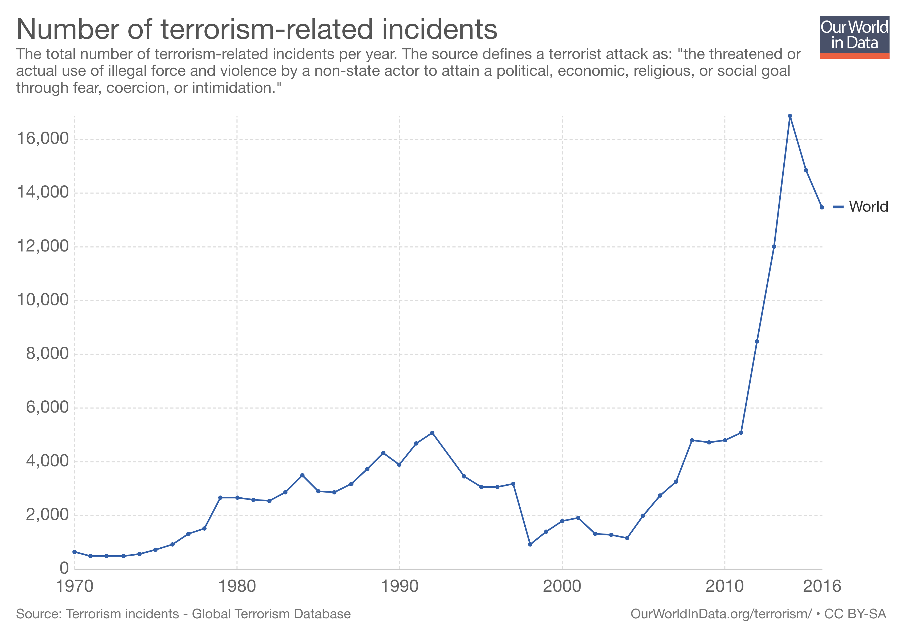

I've decided to start exploring my deepest interst - conflict resolution. I had to find relevant data online, preprocess it, and learn about causal relationships. The database used was generated by the RAND institute (see references), and is considered a benchmark in this field.

Since I wanted to find data related to terrorism, I found data that is poor formated and had to clean it:


```{r}
#clean environment:
rm(list = ls())
dat <- read.csv("/Users/oba2311/Desktop/Minerva/Junior/SS154/assignment1/date_clean.csv", header=T)
head(dat[,1:8])
```

```{r}
typeof(dat$Date)
#change to numeric:
dat$Date<-as.integer(format(as.Date(dat$Date), "%Y%m%d"))
head(dat[,1:8])
```

Let's plot a histogram of the number of attacks over time, to learn about the trend:
```{r}
date <- format(round(dat$Date, 4))
head(as.numeric(date))
his<- hist(as.numeric(date))
maxh <- max(his$counts)
strh <- strheight('W')
strw <- strwidth(max(his$counts))
his<- hist(as.numeric(date),border = "red", main="Frequency of Terror Attacks Over Time", sub=substitute(paste(italic("Notice the increase in incidents in recent years"))), ylab="Number of Attacks", xlab = "Time", breaks = 41)
text(his$mids, strh + his$counts, labels=his$counts, adj=c(0, 0.5), srt=90)

```


We see that the current millenia is much worse than the previous one. We should point out that this can also be a feature of the data: as years go by, documentation and media becomes more accurate and robust. We should expect more incidents in the data even if there was no real growth. That said, the numbers shown are dramatic and it is fair to assume that there is indeed growing number of attacks.

Before further exploring, we can compare these results with other source to validate the data:

We learn that the trend is indeed the same, even when using differert data scources.**
Let's find the outlier:
```{r}
his$mids
#map counts per year to a year:
names(his$breaks) <- his$counts
outl<-max(his$counts)
names(outl)
```
We see that the year 2006 is the highest number of attacks, in 39th place. Let's verify:
```{r}
his$breaks[39]
```

```{r}
summary(dat[,1:8]) #Omit the description column.
```
We see that the biggest terror attack led to the death of 2749 people (September 11).

We see that Iraq is the most dangerous place, and that the Taliban is the most effective and the worst terror organization. Let's verify this information once again:


We know that September 11 is a huge outlier, so let's see how to model does without it:
```{r}
no_9_11<-ifelse(dat$Fatalities>=501,501,dat$Fatalities)
no_outliers <- data.frame(dat,no_9_11)
#Check that the max of the new column does not exceed 501:
summary(no_outliers[,10])
```

```{r}
#The model predicts the number of fatalities, based on the number of injuries:
mdl<-lm(no_outliers$no_9_11 ~no_outliers$Injuries)
plot(no_outliers$no_9_11 ~no_outliers$Injuries, main="Injuries as a Regressor for Fatalities", xlab="Injuries", ylab = "Fatalities", xlim=c(0,300), ylim=c(0,250))
abline(mdl, col = "red")
```

Because of the cluster of low numbers of both fatalities and injuries, we see that the outliers make it hard to examine the plot. Let's take a look at the summary:
```{r}
summary(mdl)
```
We see _prima facie_ that both the intercept and the number of injuries are significant regressors (i.e. good predictors). Let's perform a significance test:

As the p-value is much less than 0.05 ($2e-16$), we reject the null hypothesis that $β$ = $0$. Hence there is a significant relationship between the variables in the linear regression model of the specific dataset. We can assume that this relationship will hold outside of the data (i.e. out of sample) by common sense.

#####Resources:
“RAND Databse of Worldwide Terrorism Incidents” - https://www.rand.org/nsrd/projects/terrorism-incidents.html